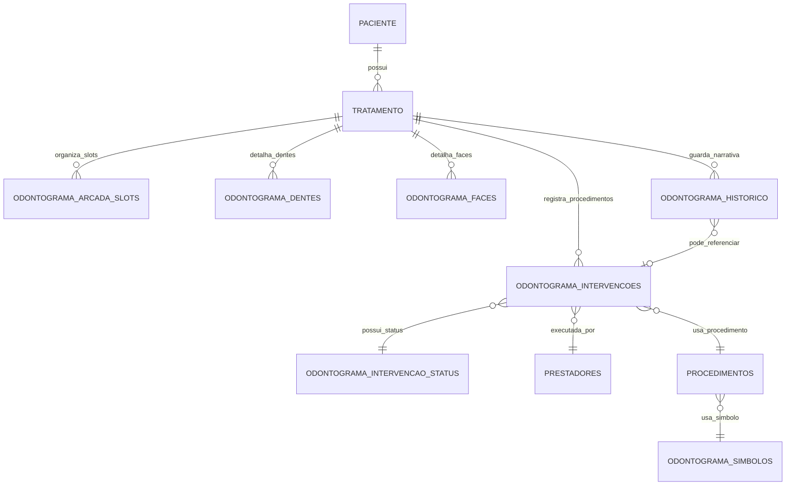

# Odontograma Brana - Contrato inicial de modelagem futura

## 1. Objetivo

Transformar os achados do odontograma EasyDental em um contrato inicial de modelagem futura para o odontograma do Brana Cloud.

Este documento nao implementa nada. Ele apenas organiza, de forma preliminar, uma direcao de modelagem segura para revisao antes de qualquer codigo.

## 2. Escopo

- Nao e implementacao
- Nao e migration
- Nao e endpoint
- Nao e tela
- Nao altera banco
- Nao altera codigo
- Nao altera frontend
- Nao altera backend
- Nao altera seeds
- Nao altera arquivos do EasyDental

## 3. Classificacao

- Modulo especifico de Odontologia
- Nao tratar como modulo core/comum
- Sem controle multiarea nesta etapa

## 4. Documentos de base consultados

- `docs/odontograma_easydental_auditoria_armazenamento_estados_cores_tabelas.md`
- `docs/odontograma_easydental_diagrama_relacional_contrato_modelagem_brana.md`
- `docs/odontograma_easydental_diagramas_mermaid.md`
- `docs/11_roadmap_desenvolvimento.md`
- `docs/regras_blindagem_correcoes_textuais_mojibake.md`

Observacao:
- O documento de aprofundamento citado em etapa anterior nao existe no workspace com esse nome.
- Esta proposta usa apenas documentos realmente existentes.

## 5. Principios de modelagem

- Separar `ARCADA` de `INTERVENCAO`
- Separar `HISTORICO` de procedimento executado
- Preservar `DENTE` e `FACE` como trilha de detalhamento anatomico
- Nao assumir cor RGB simples como regra unica
- Nao tratar slot visual como dente clinico puro
- Manter simbolos como camada propria
- Manter status de intervencao como camada propria

## 6. Proposta inicial de entidades Brana

### 6.1 Panorama das entidades

| entidade | papel | origem conceitual no EasyDental | campos provaveis | o que validar | risco de implementacao |
| --- | --- | --- | --- | --- | --- |
| `odontograma_tratamentos` | vinculo do odontograma com o contexto de tratamento | `TRATAMENTO` | `id`, `clinica_id`, `paciente_id`, `tratamento_id`, `status_id`, `created_at`, `updated_at` | se usa tratamento existente ou tabela propria | duplicar controle de tratamento |
| `odontograma_arcada_slots` | slots/posicoes visuais da arcada | `ARCADA` | `id`, `clinica_id`, `paciente_id`, `tratamento_id`, `slot_ordem`, `numero_dente_fdi`, `tipo_slot`, `anomalias`, `observacao`, `matriz_visual_json`, `created_at`, `updated_at` | cardinalidade real e persistencia da matriz visual | confundir slot com dente clinico |
| `odontograma_intervencoes` | registro de procedimento executado ou planejado | `INTERVENCAO` | `id`, `clinica_id`, `paciente_id`, `tratamento_id`, `prestador_id`, `procedimento_id`, `status_id`, `dente_id`, `face_id`, `simbolo_id`, `data_planejada`, `data_execucao`, `observacao`, `created_at`, `updated_at` | separar planejado de executado | misturar fluxo clinico com visual |
| `odontograma_intervencao_status` | status da intervencao | `_STATUS_INTERV` | `id`, `codigo_origem`, `nome`, `descricao`, `ordem`, `ativo` | quais status existem e como aparecem na UI | congelar status errados |
| `odontograma_simbolos` | simbolos visuais do odontograma | `_SIMBOLO_ODONTO` | `id`, `codigo_origem`, `nome`, `tipo_marca`, `tipo_simbolo`, `sobreposicao`, `especial`, `icone`, `bitmap_referencia`, `regra_visual_json` | portabilidade de bitmap, icone e regra visual | perder equivalencia visual com legado |
| `odontograma_faces` | marcacao por face | `FACE` | `id`, `dente_id`, `face_codigo`, `flag_visual`, `observacao`, `created_at`, `updated_at` | se o papel e persistente ou auxiliar | supermodelar faces sem uso real |
| `odontograma_dentes` | marcacao por dente | `DENTE` | `id`, `numero_fdi`, `lado`, `arcada`, `descricao`, `bitmap_referencia`, `created_at`, `updated_at` | formato real de armazenamento e uso | criar dente duplicado sem necessidade |
| `odontograma_historico` | narrativa clinica e textual | `HISTORICO` | `id`, `paciente_id`, `tratamento_id`, `intervencao_id`, `texto`, `cor`, `created_at`, `updated_at` | se referencia intervencao ou pode existir isolado | confundir narrativa com procedimento |
| `odontograma_observacoes` | observacoes livres e notas de apoio | apoio textual derivado de `HISTORICO` | `id`, `paciente_id`, `tratamento_id`, `autor_id`, `texto`, `created_at`, `updated_at` | se deve ser entidade separada ou categoria de historico | duplicar informacao textual |
| `odontograma_pacientes` ou vinculo com paciente existente | amarracao com o paciente do Brana | `PESSOAL` | `paciente_id` ou FK existente | se deve usar paciente legado do Brana | criar redundancia de cadastro |
| `odontograma_prestadores` ou vinculo com prestador existente | amarracao com executante | `PRESTADOR` | `prestador_id` ou FK existente | se Brana ja possui cadastro compativel | romper fluxo de usuario/profissional |
| `odontograma_procedimentos` ou vinculo com catalogo Brana | catalogo de procedimentos | `TAB_PRC_ITEM` | `procedimento_id`, `codigo_origem`, `nome`, `simbolo_id`, `ativo` | se o catalogo atual ja suporta simbolo odontologico | criar catalogo paralelo sem necessidade |

### 6.2 Notas sobre as entidades

- `odontograma_tratamentos` pode ser apenas um vinculo sem tabela nova, se o tratamento atual do Brana ja suportar a semantica odontologica.
- `odontograma_arcada_slots` e a camada mais importante para guardar a estrutura visual da arcada.
- `odontograma_intervencoes` e a camada principal para o procedimento executado ou planejado.
- `odontograma_simbolos` precisa preservar a semantica visual do EasyDental, mas sem assumir que bitmap/icone sera portavel sem adaptacao.
- `odontograma_historico` nao deve virar tabela principal do procedimento.
- `odontograma_observacoes` so faz sentido se houver separacao clara entre narrativa clinica e observacao livre.

## 7. Separacao por responsabilidade

### Estrutura visual

- `odontograma_arcada_slots`

### Procedimentos

- `odontograma_intervencoes`
- `odontograma_intervencao_status`
- vinculo com procedimentos

### Simbolos

- `odontograma_simbolos`

### Anatomia

- `odontograma_dentes`
- `odontograma_faces`

### Narrativa

- `odontograma_historico`
- `odontograma_observacoes`

## 8. Campos candidatos

### 8.1 `odontograma_arcada_slots`

- `id`
- `clinica_id`
- `paciente_id`
- `tratamento_id`
- `slot_ordem`
- `numero_dente_fdi`
- `tipo_slot`
- `anomalias`
- `observacao`
- `matriz_visual_json`
- `created_at`
- `updated_at`

### 8.2 `odontograma_intervencoes`

- `id`
- `clinica_id`
- `paciente_id`
- `tratamento_id`
- `prestador_id`
- `procedimento_id`
- `status_id`
- `dente_id`
- `face_id`
- `simbolo_id`
- `data_planejada`
- `data_execucao`
- `observacao`
- `created_at`
- `updated_at`

### 8.3 `odontograma_simbolos`

- `id`
- `codigo_origem`
- `nome`
- `tipo_marca`
- `tipo_simbolo`
- `sobreposicao`
- `especial`
- `icone`
- `bitmap_referencia`
- `regra_visual_json`

## 9. Diagrama textual Brana futuro

```text
PACIENTE
  └── TRATAMENTO
        ├── ODONTOGRAMA_ARCADA_SLOTS
        ├── ODONTOGRAMA_INTERVENCOES
        │     ├── ODONTOGRAMA_INTERVENCAO_STATUS
        │     ├── PROCEDIMENTOS
        │     ├── PRESTADORES
        │     └── ODONTOGRAMA_SIMBOLOS
        ├── ODONTOGRAMA_DENTES
        ├── ODONTOGRAMA_FACES
        └── ODONTOGRAMA_HISTORICO
              └── ODONTOGRAMA_OBSERVACOES
```

## 10. Mermaid Brana futuro



## 11. Mapeamento EasyDental -> Brana

| EasyDental | Brana futuro | observacao |
| --- | --- | --- |
| `PESSOAL` | paciente Brana | entidade raiz do paciente |
| `TRATAMENTO` | tratamento/plano odontologico Brana | base do contexto odontologico |
| `ARCADA` | `odontograma_arcada_slots` | estrutura visual da arcada |
| `INTERVENCAO` | `odontograma_intervencoes` | procedimentos planejados ou executados |
| `_STATUS_INTERV` | `odontograma_intervencao_status` | camada propria de status |
| `TAB_PRC_ITEM` | procedimentos/catalogo Brana | vinculo com catalogo atual ou novo |
| `_SIMBOLO_ODONTO` | `odontograma_simbolos` | camada propria de simbolos |
| `HISTORICO` | `odontograma_historico` / observacoes clinicas | narrativa e notas |
| `DENTE` | `odontograma_dentes` | detalhamento anatomico por dente |
| `FACE` | `odontograma_faces` | detalhamento anatomico por face |

## 12. O que nao implementar ainda

- Nao criar migration ainda
- Nao criar endpoint ainda
- Nao criar UI ainda
- Nao importar dados ainda
- Nao copiar bitmaps ainda
- Nao criar seed de simbolos ainda
- Nao alterar procedimentos atuais
- Nao alterar ficha do paciente
- Nao alterar historico atual

## 13. Riscos

- Cardinalidade real ainda precisa validacao
- `DENTE` e `FACE` ainda precisam aprofundamento
- Simbolos e bitmaps podem nao ser portaveis diretamente
- Cor visual pode depender de regra da aplicacao
- Migracao de dados pode exigir etapa propria
- Integracao com procedimentos Brana pode afetar financeiro e orcamento
- Risco de confundir procedimento planejado com executado
- Risco de confundir historico narrativo com intervencao

## 14. Criterios minimos antes de codificar

Antes de qualquer implementacao, sera necessario:

- validar `DENTE` e `FACE` em pacientes com intervencoes
- validar status reais em `_STATUS_INTERV`
- validar exemplos de `INTERVENCAO` com procedimentos odontograficos
- validar como planejado e executado aparecem visualmente
- validar se o Brana ja tem entidade tratamento compativel
- validar vinculo com tabela de procedimentos Brana
- validar necessidade de seed inicial de simbolos
- validar regra de cores e renderizacao
- definir escopo minimo da primeira implementacao

## 15. Onde testar futuramente

- Ficha do paciente
- aba odontograma
- cadastro/selecao de procedimento
- marcacao por dente
- marcacao por face
- historico clinico
- comparacao visual com EasyDental

## 16. Registro para roadmap

- Criacao do contrato inicial de modelagem futura do odontograma Brana
- Base em auditoria EasyDental, diagrama relacional e diagramas Mermaid
- Modulo especifico de Odontologia
- Etapa somente documental
- Nenhum codigo alterado
- Nenhum banco alterado
- Sem migration, endpoint ou UI
- Proxima etapa futura recomendada: validar `DENTE`/`FACE` e status de `INTERVENCAO` antes de codificar
