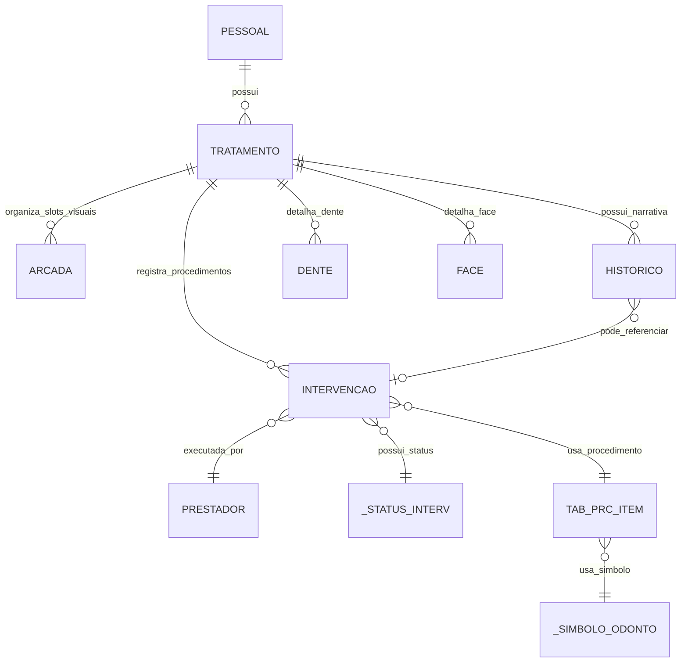
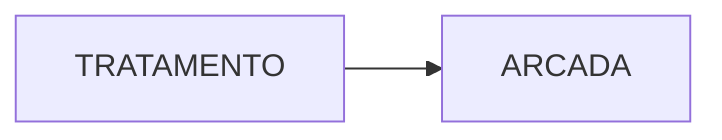
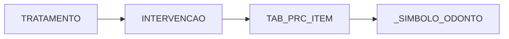
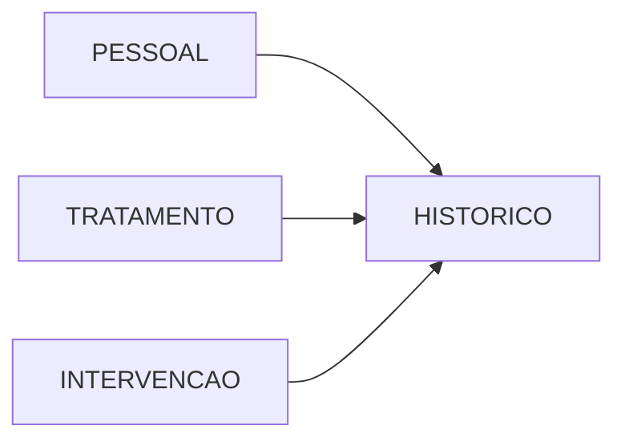
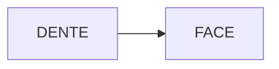
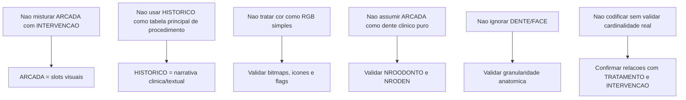

# Odontograma EasyDental - Diagramas Mermaid revisaveis

## 1. Objetivo

Transformar o contrato relacional ja consolidado do odontograma EasyDental em diagramas Mermaid de revisao visual, sem implementar nada.

Esta etapa existe para apoiar:
- leitura rapida da modelagem atual;
- validacao das relacoes mais importantes;
- comparacao futura com a modelagem do odontograma Brana;
- reducao de ambiguidade antes de qualquer codigo.

## 2. Escopo

- Fonte principal consolidada: `docs/odontograma_easydental_diagrama_relacional_contrato_modelagem_brana.md`
- Fonte de apoio tecnica: `docs/odontograma_easydental_auditoria_armazenamento_estados_cores_tabelas.md`
- Fonte de apoio de roadmap: `docs/11_roadmap_desenvolvimento.md`
- Blindagem textual consultada: `docs/regras_blindagem_correcoes_textuais_mojibake.md`
- Classificacao funcional: modulo especifico de Odontologia
- Esta etapa e apenas documental

## 3. Confirmacao de etapa somente documental

- Nenhum codigo foi alterado
- Nenhum frontend foi alterado
- Nenhum backend foi alterado
- Nenhum banco foi alterado
- Nenhum seed foi alterado
- Nenhum arquivo do EasyDental foi alterado
- Nenhuma migration foi executada
- Nenhuma tela foi criada
- Nenhum endpoint foi criado
- Nenhuma tabela foi criada

## 4. Classificacao do modulo

- Odontograma = modulo especifico de Odontologia
- Nao tratar como modulo core/comum
- Nao implementar controle multiarea nesta etapa

## 5. Documentos de base consultados

- `docs/odontograma_easydental_diagrama_relacional_contrato_modelagem_brana.md`
- `docs/odontograma_easydental_auditoria_armazenamento_estados_cores_tabelas.md`
- `docs/11_roadmap_desenvolvimento.md`
- `docs/regras_blindagem_correcoes_textuais_mojibake.md`

Observacao:
- O documento de aprofundamento citado no pedido nao estava presente no workspace com o nome informado no momento desta consolidacao.
- A consolidacao foi feita com base no contrato relacional, na auditoria e no roadmap ja existentes.

## 6. Diagrama Mermaid principal

Leitura sugerida:
- `PESSOAL` ancora o contexto do paciente
- `TRATAMENTO` organiza a sessao/plano odontologico
- `ARCADA` representa os slots visuais da arcada
- `INTERVENCAO` registra a execucao de procedimentos
- `HISTORICO` guarda a narrativa clinica/textual
- `DENTE` e `FACE` aprofundam a granularidade anatomica
- `TAB_PRC_ITEM` liga o catalogo ao simbolo visual
- `_SIMBOLO_ODONTO` define a representacao simbolica do procedimento

## 7. Diagrama por responsabilidade

### 7.1 Estrutura visual

Leitura:
- `TRATAMENTO` organiza a estrutura visual
- `ARCADA` representa a malha de slots/desenho da arcada

### 7.2 Procedimentos

Leitura:
- `INTERVENCAO` e o ponto central de registro do procedimento
- `TAB_PRC_ITEM` identifica o item/procedimento
- `_SIMBOLO_ODONTO` traduz o item em simbolo/icone/bitmap

### 7.3 Narrativa clinica

Leitura:
- `HISTORICO` nao deve ser tratado como tabela principal de procedimento
- `HISTORICO` funciona como narrativa clinica/textual e pode referenciar eventos

### 7.4 Detalhamento anatomico

Leitura:
- `DENTE` e `FACE` sao camadas para detalhamento anatomico
- nao substituir a analise de `ARCADA` e `INTERVENCAO` por essas duas tabelas

## 8. Diagrama de risco de modelagem

## 9. Glossario rapido

- `PESSOAL`: paciente/contexto principal
- `TRATAMENTO`: plano ou contexto odontologico do paciente
- `ARCADA`: posicoes visuais da arcada no odontograma
- `INTERVENCAO`: registro da execucao do procedimento
- `HISTORICO`: narrativa clinica/textual e observacoes
- `DENTE`: detalhe por dente
- `FACE`: detalhe por face
- `PRESTADOR`: profissional que executa ou referencia a intervencao
- `_STATUS_INTERV`: status da intervencao
- `TAB_PRC_ITEM`: catalogo de procedimentos
- `_SIMBOLO_ODONTO`: legenda simbolica/visual do odontograma

## 10. Fatos confirmados

- `ARCADA` possui 32 linhas na fotografia analisada do paciente 646.
- `ARCADA.NROTRA` referencia `TRATAMENTO.NROTRA`.
- `ARCADA.NRODEN` organiza a ordem dos slots visuais.
- `ARCADA.NROODONTO` mapeia a numeracao FDI da arcada.
- Existe pelo menos um slot especial com `NROODONTO = 0`.
- `INTERVENCAO` existe e esta populada na base.
- `INTERVENCAO` nao tinha linhas para o paciente 646 na fotografia consultada.
- `HISTORICO` no paciente 646 mostrou entradas textuais e de receita.
- `TAB_PRC_ITEM.NROSIM` referencia `_SIMBOLO_ODONTO.NROSIM`.
- `_SIMBOLO_ODONTO` usa `BITMAP1`, `BITMAP2`, `BITMAP3`, `ICONE`, `TIPMARCA`, `TIPSIMB`, `SOBREPOS` e `ESPECIAL`.
- Nao apareceu um campo mestre unico de cor RGB para o odontograma.
- `DENTE` e `FACE` sao tabelas relevantes, mas nao trouxeram linhas para o paciente 646 nesta fotografia.

## 11. Inferencias

- `ARCADA` e uma tabela de slots visuais da arcada, nao apenas de dentes clinicos puros.
- `INTERVENCAO` e a tabela canonica de execucao de procedimento.
- `HISTORICO` e narrativa clinica/textual e pode ancorar uma intervencao, mas nao parece ser a tabela principal do procedimento.
- O desenho do odontograma e determinado por simbolos, bitmaps e flags, nao por uma cor RGB unica.
- `DENTE` e `FACE` devem servir para detalhamento anatomico e de marcacao, mas precisam de validacao manual adicional.

## 12. Perguntas abertas antes de implementar

- Qual cardinalidade real deve ser assumida entre `TRATAMENTO`, `ARCADA` e `INTERVENCAO`?
- `DENTE` e `FACE` sao persistencia obrigatoria ou apenas apoio visual?
- `HISTORICO` sempre referencia uma `INTERVENCAO` ou pode existir isolado?
- O simbolo visual vem do `ICONE` ou dos bitmaps associados?
- `ARCADA.ANOMALIAS` deve ser modelada como bitmask ou como entidade separada?
- Existe alguma regra de cor adicional que nao apareceu na fotografia consultada?

## 13. Criterios minimos antes de codificar

- Confirmar a cardinalidade real entre `TRATAMENTO`, `ARCADA` e `INTERVENCAO`.
- Confirmar se `DENTE` e `FACE` sao persistencia obrigatoria ou apenas apoio visual.
- Confirmar o papel real de `HISTORICO` no fluxo do odontograma.
- Confirmar se o desenho usa somente simbolos/bitmaps ou tambem regras de cor adicionais.
- Confirmar se a modelagem futura precisa de uma tabela de regioes separada.
- Confirmar se os status de intervencao e tratamento precisam de tabela propria ou lookup reaproveitado.

## 14. Onde testar futuramente

- Na tela do odontograma, comparando visualmente arcada, procedimentos, faces e historico.
- Na navegacao de paciente com tratamento ativo.
- Na grade inferior de procedimentos e seu reflexo na arcada.
- No fluxo de marcacao por dente e por face.
- Em validacao manual de status de intervencao e tratamento.

## 15. Registro para roadmap

- Consolidacao do contrato relacional do odontograma EasyDental convertida em diagramas Mermaid revisaveis.
- Etapa mantida somente documental, sem implementacao.
- Modulo classificado como especifico de Odontologia.
- Nenhum codigo alterado.
- Nenhum banco alterado.
- Documento novo: `docs/odontograma_easydental_diagramas_mermaid.md`
